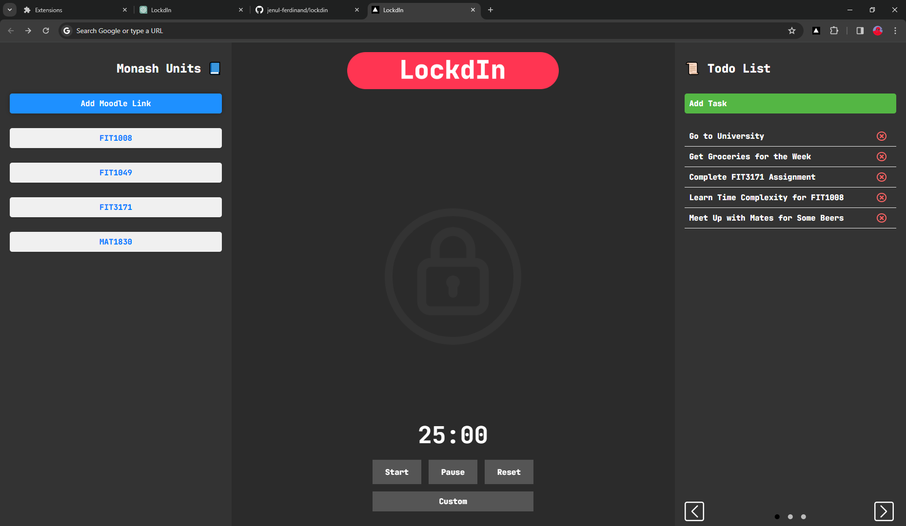

# LockdIn (Chrome Extension)
LockdIn aims to enhance the productivity of **Monash University** students by eliminating distractions and prioritizing academic content in the Chrome browser.

## ❓ What is it?

LockdIn functions as a **Chrome Extension**, serving as a new tab override that presents a dedicated landing page each time you open a new tab.

 
 

 

## 📦 Usage

To use LockdIn, follow these steps:

1. Clone the repository to your local machine.
2. Open Google Chrome.
3. Navigate to `chrome://extensions/`.
4. Enable Developer mode.
5. Click "Load unpacked" and select the cloned LockdIn repository folder.

Now, every time you open a new tab, LockdIn will take charge, providing a distraction-free landing page designed to help you concentrate on your academic tasks.

## ❤ Contributors

- Jenul Ferdinand - Project Lead / Programmer
- Louis Fevrier - Programmer
- Mitchell Augustini - Developer
- King (Zenan) Wu - Developer / Marketing
- Oliver Bassily - Jr Developer / Marketing
  
---
